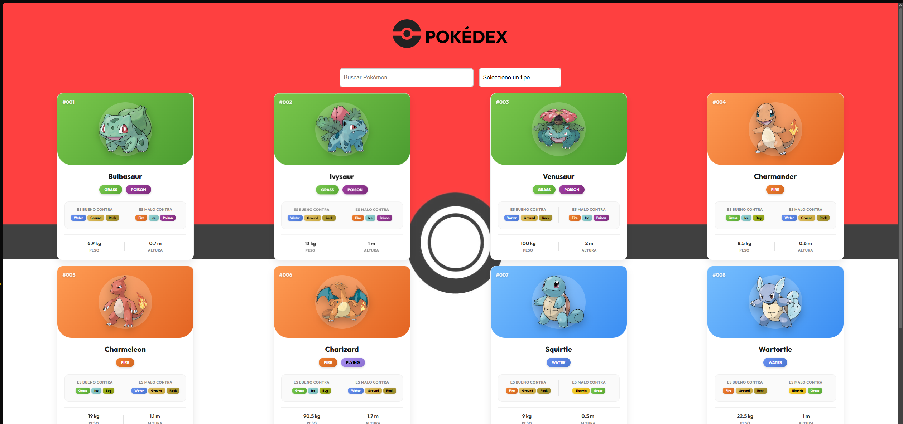
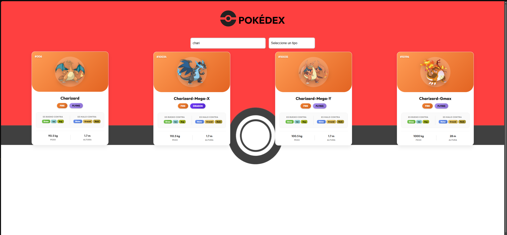
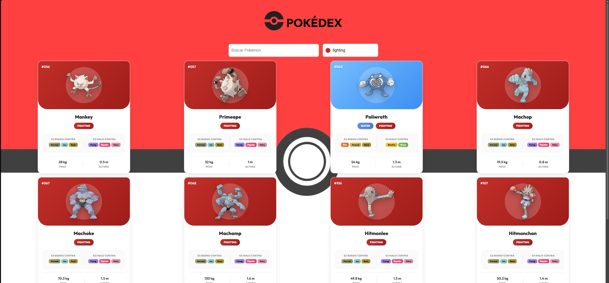
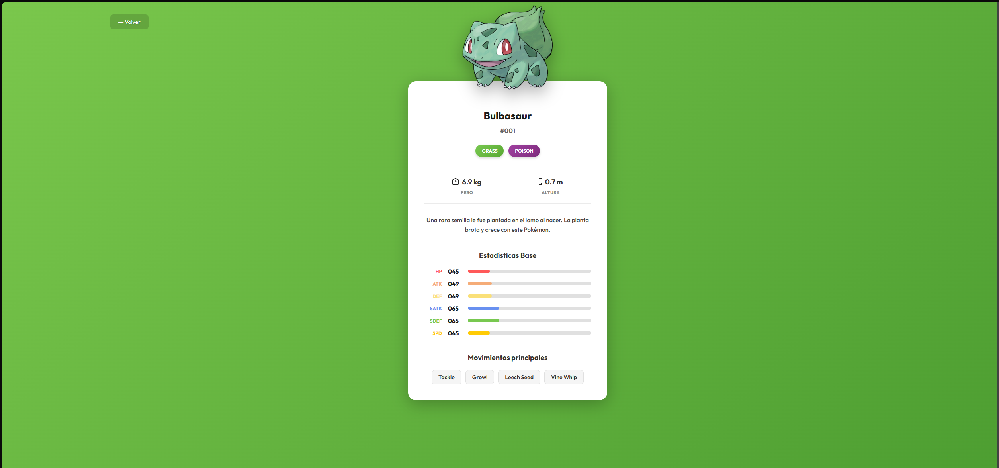

# 📖 Pokédex App

📌 Aplicación web de Pokédex que muestra información detallada de Pokémon con un diseño atractivo y responsive.

## 📌 Tabla de Contenidos
- Características
- Tecnologías utilizadas
- Instalación y ejecución
- Funcionalidades principales


---

## ⭐ Características
✔️ Visualización de tarjetas de Pokémon con imágenes y tipos.  
✔️ Diseño responsive adaptable a móviles y escritorio.  
✔️ Búsqueda y filtrado de Pokémon por nombre y tipo.  
✔️ Página de detalles con estadísticas de combate, peso, altura y habilidades.  
✔️ Navegación fluida con React Router.  
✔️ Consumo de datos con GraphQL desde la PokéAPI.  
✔️ Indicador de carga y manejo de errores en las peticiones a la API.

---

## 🔧 Tecnologías Utilizadas
- **Frontend:** React + Vite  
- **Lenguaje:** TypeScript  
- **Estilos:** CSS puro  
- **API:** GraphQL con PokéAPI  
- **Routing:** React Router  

---

## 🖼️ Capturas de Pantalla
### Ingresar Pokedex() 

### Lista Pokemon(Pokedex) 

### Filtrado por Tipo

### Filtrado por Nombre

### Carta Pokemon



---

## 🚀 Instalación y Ejecución

### 1️⃣ Clonar el repositorio
```bash
git clone https://github.com/Santiageoff/Pokedex.git
#### Instalar Dependencias npm install
#### Ejecutar en modo desarollador npm run dev
